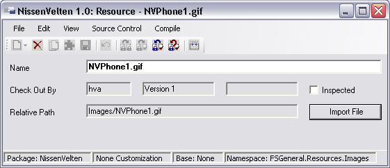

# Resources

## Allgemeines

Ressourcen ermöglichen dem Entwickler, der Anwendung beliebige Dateien zur Verfügung zu stellen. Typische Beispiele für Ressourcen sind:

* von der Anwendung benötigte Bilder
* Custom Control Erweiterungen auf der Seite der Clients
* externe Bibliotheken (dlls), die von der Anwendung benutzt werden

## Bedeutung von Namespaces für Ressourcen

Ressourcen können im Objekt-Baum ([Registerkarte Namespaces](../ide/registerkarten.md#registerkarte-namespaces)) im Namespace **FSGeneral / Resources** angelegt werden. Beim Kompilieren von Ressourcen werden diese dann direkt ins Brokerverzeichnis kopiert.

Außerdem können im Namespace **FSGeneral / Resources** weitere Namespaces angelegt werden. Diese Namespaces werden beim Kompilieren von Ressourcen automatisch als Unterverzeichnisse im Brokerverzeichnis angelegt, sobald sie eine Ressource enthalten. Die Ressourcen eines Unter-Namespaces werden dann ins entsprechende Unterverzeichnis des Brokers kopiert.

## Erstellen und Löschen von Ressourcen

Für das Erstellen und Löschen ist zu beachten, in welchem Namespace die Ressource angelegt werden muss ([Bedeutung von Namespaces für Ressourcen](#bedeutung-von-namespaces-für-ressourcen)). Ansonsten werden Ressourcen wie alle anderen Elemente angelegt.

* [**Erstellen einer Ressource**](../ide/bearbeiten-von-elementen.md#elemente-erstellen)

* [**Löschen einer Ressource**](../ide/bearbeiten-von-elementen.md#elemente-löschen)

## Bearbeiten von Ressourcen

Durch einen Doppelklick auf eine Ressource im Objekt-Baum wird das Designer-Fenster geöffnet.

**Resource:**

Dort können Sie mit dem Button **Import File** einen Dateiauswahldialog öffnen. Dort wählen Sie die Datei aus, die ins Brokerverzeichnis kopiert werden soll. Nach dem Import wird der Name der Ressource mit dem Namen der ausgewählten Datei initialisiert. Sie können diesen Namen im Textfeld **Name** ändern. Im nicht editierbaren Textfeld **Relative Path** wird der Pfad relativ zum Brokerverzeichnis angezeigt, unter dem die Datei letztendlich angelegt wird. Der Pfad ergibt sich aus dem Namespace, in dem die Ressource angelegt wurde ([Bedeutung von Namespaces für Ressourcen](#bedeutung-von-namespaces-für-ressourcen)) und dem Namen der Ressource.

Erläuterungen zu den Standardfunktionen, die im Designer-Fenster für Ressourcen angeboten werden, finden Sie unter [Allgemeine Funktionalitäten](../ide/allgemeine-funktionatitaeten.md).
