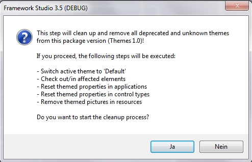
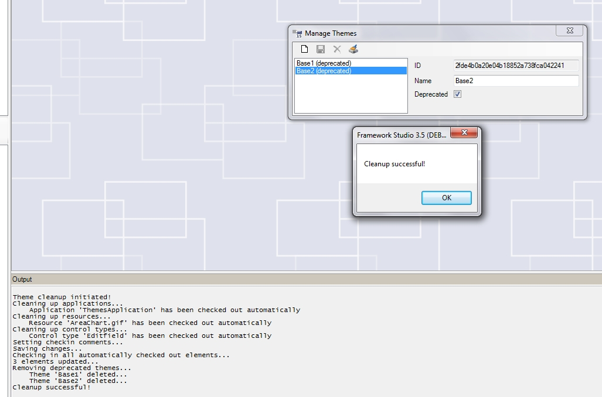
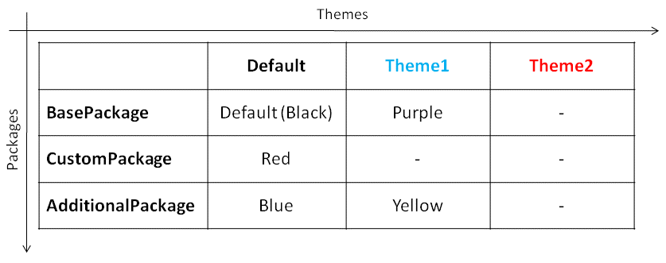

# Aufräum-Routine

Diese Routine ist verantwortlich dafür, Themes korrekt aus einem Package zu entfernen. Da nicht nur die Themes alleine von Framework Studio gespeichert werden, sondern auch Referenzen von den Applications, Default Control Styles und Ressourcen auf die Themes verweisen, müssen vor dem endgültigen Löschen der Themes erst alle Referenzen in diesen Elementen eliminiert werden.

Gelöscht werden grundsätzlich alle Themes im aktuellen Package, die im Theme Manager auf „Deprecated“ gesetzt wurden. Es werden erst alle Applications, Default Control Styles und Ressourcen durchlaufen und jegliche Referenzen auf nicht vorhandene oder auf **Deprecated** gesetzte Themes eliminiert und danach die Themes an sich gelöscht.

Mit dem Button  im Theme Manager kann die Routine gestartet werden. Es erfolgt zur Sicherheit noch eine Abfrage, ob fortgefahren werden soll:

Sicherheitsabfrage der Aufräum-Routine

Bevor die Routine startet, wird von Framework Studio auf das Default-Theme gewechselt. Um Änderungen an den Applications, Default Control Styles und Ressourcen vornehmen zu können, müssen diese Elemente ausgecheckt sein. Dies wird von der Routine selbst übernommen. Ist ein zu bearbeitendes Element nicht ausgecheckt, wird es automatisch ausgecheckt und nach erfolgreichem Ablauf der Routine wieder eingecheckt. Sollte ein zu änderndes Element schon vom Benutzer ausgecheckt worden sein, wird die Routine die Änderungen am Element durchführen, es aber nach erfolgreichem Ablauf **NICHT** einchecken (Der Benutzer könnte schon andere Änderungen am Element vorgenommen haben, die er vielleicht noch gar nicht einchecken will). Der Ablauf der Routine selbst ist im Output-Fenster von Framework Studio einsehbar:

Ablauf der Routine im Output-Fenster:

Nun muss noch folgender Fall betrachtet werden: Was ist, wenn ein Package Theme-Informationen beinhaltet, die auf Themes verweisen, die im Basis-Package definiert wurden und dort gelöscht werden?

Dafür wird noch einmal die Konstellation von 3 Packages und 2 Themes betrachtet:

Theme-Definition für die FocusHighlightColor:

Beide Themes sind im Package „BasePackage“ über den Theme-Manager angelegt worden. Nun gibt es 2 Szenarien, in denen „unnötige Theme-Daten“ in den aufgesetzten Packages (CustomPackage und AdditionalPackage) entstehen.

##### **Szenario 1**

Im BasePackage werden z.B. beide Themes auf **Deprecated** gesetzt und die Aufräum-Routine ausgeführt. Danach ist im BasePackage nur noch das Default-Theme vorhanden und jegliche Informationen zu den Themes in den Applications, Default Control Styles und Ressourcen gelöscht.

Da die Themes im BasePackage gelöscht wurden, sind diese nun auch nicht mehr in den aufsetzenden Packages auswählbar. Die Property-Informationen zu den Themes in den aufsetzenden Packages sind jedoch noch im Repository gespeichert. So ist die Information ***Yellow*** für die FHC für Theme1 im AdditionalPackage immer noch im Repository vorhanden, obwohl das Theme längst aus dem BasePackage gelöscht wurde. Dies hat zur Folge, dass bei jedem CheckIn/CheckOut der Application diese nunmehr sinnlose Information **mitgeschleift** wird.

Es empfiehlt sich also, die Aufräum-Routine auch in den aufsetzenden Packages durchzuführen. Die Routine erkennt nicht nur auf **Deprecated** gesetzte Themes, sondern eliminiert auch jegliche Informationen zu Themes, die in der Package-Hierarchie nicht mehr auffindbar sind.

Im konkreten Fall würde die Routine im AdditionalPackage die Application durchgehen, in der für Theme1 für die FHC ***Yellow*** definiert wurde. Sie erkennt dann, dass die das Theme **Theme1** gar nicht mehr in der Package-Hierarchie auffinden kann (da es ja im BasePackage gelöscht wurde). Somit wird diese Property-Information aus dem AdditionalPackage gelöscht und die Application hat, bezogen auf die Themes, wieder einen sauberen Stand.

##### **Szenario 2**

Da Framework Studio die Möglichkeit bietet, Packages beliebig in der Hierarchie anzuordnen, kann folgender Fall eintreten:

Das BasePackage mit den 2 definierten Themes wird aus der Hierarchie entfernt und ein neues BasePackage wird an dessen Stelle gesetzt. In diesem neuen BasePackage sind jedoch die Themes überhaupt nicht definiert. Ab diesem Zeitpunkt ist die Situation wieder wie in Szenario 1. Die aufsetzenden Packages CustomPackage und AdditionalPackage haben in ihren Elementen Theme-Informationen für Themes, die gar nicht mehr in der Package-Hierarchie existieren. Das Starten der Aufräum-Routine in den Packages CustomPackage und AdditionalPackage würde diese **Unsauberkeiten** bereinigen.

> [!NOTE]
> Wenn Themes gelöscht werden und die Aufräum-Routine in aufsetzenden Packages NICHT ausgeführt wird, hat dies funktional KEINEN Einfluss auf die Anwendungen. Es werden lediglich unnütze Daten im Repository von Version zu Version **mitgeschleift**.
