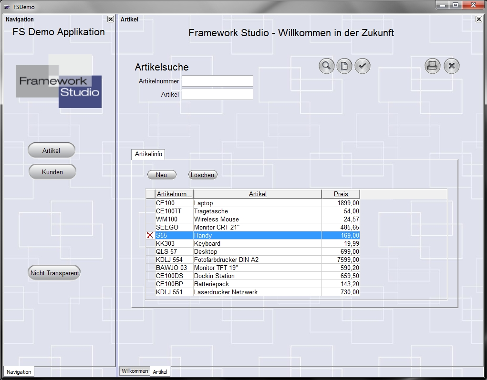
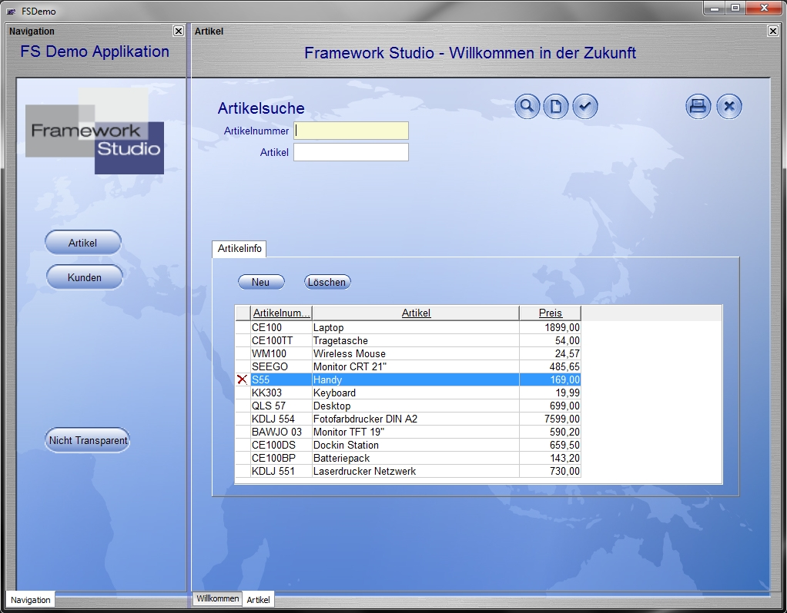

# Einführung

Durch Themes wird die Möglichkeit gegeben, einer FS-Anwendung ein anderes Aussehen zu geben, ohne dabei auf die Geschäftslogik und damit den Sourcecode Einfluss zu nehmen.

##### **Beispiel**

FS-Demo mit Standard-Theme:

Das Bild zeigt die FS-Demo-Anwendung, wie sie standardmäßig von Framework Studio erstellt wird. Im folgenden Bild wurde das Aussehen der Anwendung durch Hinzufügen eines Themes grundlegend verändert:

In diesem neuen Theme wurden folgende Änderungen durchgeführt:

* Hintergrundbild geändert.
* Transparenz des Grids deaktiviert.
* Button-Images durch blaue Bilder ersetzt.
* Schriftfarbe der Labels auf blau gesetzt.
* FocusHighlightColor auf hellgelb gesetzt.
