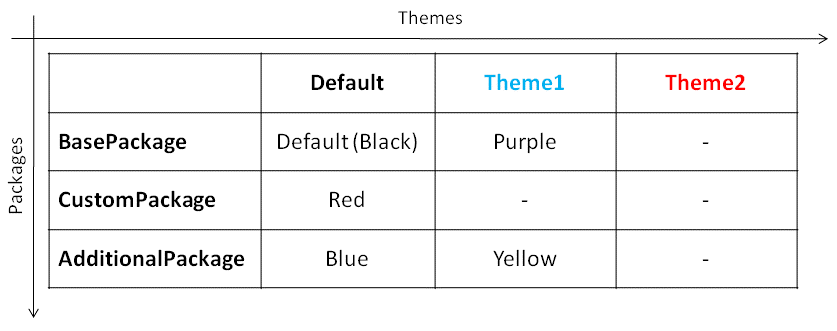
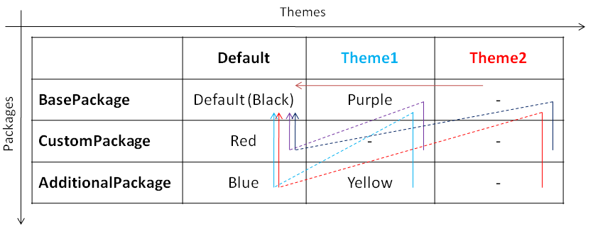

# Hierarchie bei mehreren Packages und Themes

Wenn mehrere Packages übereinander liegen und mehrere Themes verfügbar sind, folgt Framework Studio einem gewissen Schema, woher die einzelnen Property-Werte bezogen werden. Dieses Schema ist für Properties der Applications, der Default Control Styles, sowie der Bilder der Ressourcen exakt gleich. Im folgenden Beispiel wird angenommen, dass 3 Packages übereinander liegen und im untersten Package (BasePackage) 2 Themes definiert wurden, die somit auch den anderen Packages zur Verfügung stehen. Das Property, welches hier betrachtet werden soll, ist die FocusHighlightColor (im Folgenden FHC) einer Application. Die FHC soll in der Package-Hierarchie wie folgt definiert sein:

Theme-Definition für die FocusHighlightColor:

Ist die FHC im aktuellen Package für das gewählte Theme nicht definiert (wie z.B. bei CustomPackage/Theme2), werden erst alle Basis-Packages durchsucht, ob dort das Property für das gewählte Theme gesetzt ist. Ist dies nicht der Fall, wird die gleiche Suche für das Property im Default-Theme angestoßen (siehe Pfeile).

Anhand der folgenden Grafik soll nun erläutert werden, welche Werte die FHC je Package und Theme annehmen würde:

Lookup-Pfad des Themeable Properties:

##### **Beispiel BasePackage/Theme1**

Da im BasePackage für das Theme **Theme1** die FHC explizit auf ***Purple*** gesetzt wurde, wird keine Hierarchiesuche angestoßen und die FHC ist somit ***Purple***.

##### **Beispiel BasePackage/Theme2**

Im BasePackage ist die FHC für das Theme **Theme2** nicht definiert. Da das BasePackage kein weiteres Basis-Package hat, wird der Wert des Default-Theme zurückgegeben. In diesem Fall ist im Default-Theme auch nicht explizit ein Wert gesetzt, also wird die Standardfarbe für die FHC (Black) zurückgegeben.

##### **Beispiel CustomPackage/Theme1**

Für Theme1 ist im CustomPackage keine FHC definiert, also wird im Basis-Package von CustomPackage (BasePackage) für das Theme1 nach der FHC gesucht. Dort ist ***Purple*** definiert und wird somit zurückgegeben.

##### **Beispiel CustomPackage /Theme2**

Im CustomPackage ist die FHC für Theme2 nicht definiert. Es wird somit in BasePackage für Theme2 nach einem Wert gesucht. Dort ist ebenso kein Wert definiert. Es verbleiben keine weiteren Basis-Packages, also wird wieder vom CustomPackage aus durch die Hierarchie gesucht, diesmal jedoch mit dem Default-Theme (da für Theme1 in keinem Package ein Wert für FHC definiert wurde). Für das Default-Theme ist im CustomPackage der Wert ***Red*** für die FHC definiert und wird somit zurückgegeben.

##### **Beispiel AdditionalPackage/Theme1**

In diesem Beispiel ist im AdditionalPackage für das Theme1 gleich ein Wert für die FHC definiert. ***Yellow*** wird sofort zurückgegeben.

##### **Beispiel AdditionalPackage /Theme2**

Für Theme2 ist in keinem der Packages ein Wert für die FHC definiert. Somit wird die Package-Hierarchie für das Default-Theme nach einem Wert für die FHC durchsucht. Im AdditionalPackage wird für das Default-Theme gleich ein Wert ***Blue*** gefunden und zurückgegeben.
