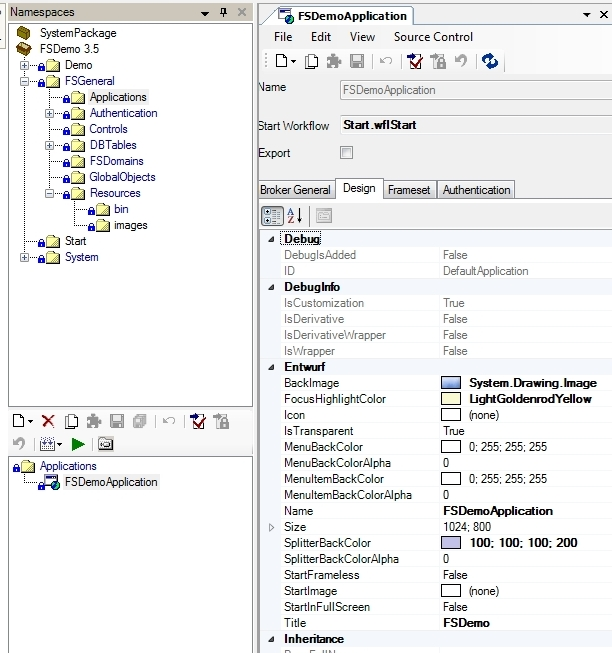

# Properties Theme-abhängig ändern

Um in Applications oder Default Control Styles Properties Theme-abhängig ändern zu können, muss nur das entsprechende Theme ausgewählt werden. Wird nun ein Property modifiziert, wird die Information automatisch dem aktuell aktiven Theme zugeordnet.

## Properties ändern bei Applications

##### **Beispiel**

Wurde vom Benutzer kein Theme ausgewählt (d.h. das Default-Theme ist aktiv), sieht die **FSDemoApplication** im Design-Panel wie folgt aus:

Application PropertyGrid im Default-Theme:

Ein **BackImage** wurde definiert, **IsTransparent** aktiviert, SplitterBackColor und die Farben für Menüs wurden modifiziert.

Wird nun ein anderes Theme (über **Tools** > **Choose Theme**) ausgewählt, werden die Properties, bezogen auf das nun ausgewählte Theme, angezeigt und können geändert werden:

Application PropertyGrid im angepassten Theme:

Im Gegensatz zum Default-Theme wurde hier ein anderes **BackImage** definiert. Das Property „FocusHighlightColor“ ist auf einen Gelbton abgeändert worden (im Default-Theme war hier nichts definiert). Auch die **SplitterBackColor** wurde neu zugewiesen.

## Properties ändern bei Default Control Styles

Das Theme-abhängige Modifizieren von Properties eines Default Control Styles gestaltet sich analog zu den Applications:

##### **Beispiel**

Im Folgenden wird der Default Control Style des Button-Controls angezeigt, während der Benutzer das Default-Theme ausgewählt hat:

DefaultControlStyle PropertyGrid im Default-Theme:

Die BackColor wurde auf **ButtonFace**, die Font auf *Arial; 12pt* und die ForeColor auf *Red* gesetzt.

Wird nun wiederrum ein Theme ausgewählt, könnten die Properties z.B. wie folgt umdefiniert werden:

DefaultControlStyle PropertyGrid im angepassten Theme:

## Bild ändern bei Ressourcen

Ist das Default-Theme aktiv, kann ein Bild über den Button Import File an die Resource gebunden werden. Der Name der Resource wird dabei standardmäßig auf den Namen der importierten Datei angepasst:

Bild-Resource im Default-Theme:

Wird nun ein Theme vom Benutzer ausgewählt, hat der Benutzer die Möglichkeit über den Button **Import File** erneut eine Bilddatei zu importieren. Diese wird dann jedoch dem Theme zugeordnet und das Bild des Default-Themes (der graue Buttonhintergrund) bleibt erhalten.

Resource mit angepasstem Bild:

In dieser Grafik wurde für die Resource *NVButton1.gif* ein neues Bild für das ausgewählte Theme importiert. Dass das Bild im aktiven Theme überschrieben ist, zeigt sich an der fetten Schrift des **Relative Path** und daran, dass der Reset-Button aktiv ist. In der Resource wurde der graue Button-Hintergrund durch einen bläulichen ausgetauscht.

Wird wieder zum Default-Theme gewechselt, würde die Resource wieder den grauen Button-Hintergrund anzeigen.

### **Bild zurücksetzen**

Ist einer Resource für ein Theme ein abweichendes Bild zugeordnet, kann dies durch den Reset-Button wieder auf das Default-Bild zurückgesetzt werden.

##### **Beispiel**

Der Resource ist im Default-Theme, wie in den obigen Grafiken zu sehen, der graue Button-Hintergrund zugewiesen und im Theme der bläuliche. Befindet sich der Benutzer nun im Theme und klickt den Reset-Button, wird der bläuliche Buttonhintergrund aus der Resource für das Theme entfernt und der graue Button-Hintergrund würde auch für das Theme verwendet werden (siehe [Hierarchie bei mehreren Packages und Themes](hierarchie-bei-mehreren-package-und-themes.md)).

> [!IMPORTANT]
> Wird einer Resource bei aktiviertem Theme ein Bild zugewiesen und ist das Bild für das Default-Theme noch nicht gesetzt, wird das im Theme importierte Bild auch als Bild für das Default-Theme hinzugefügt.
