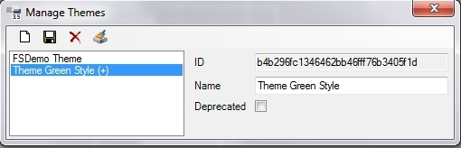

# Verwalten

Die Themes werden über den **Theme Manager** verwaltet. Dieser kann über das Menü **Tools** > **Manage Themes** aufgerufen werden.

In der Liste werden alle verfügbaren Themes angezeigt. Sind Themes in einem oder mehreren Basis-Packages des aktuellen Packages definiert, werden diese mit dem jeweiligen Packagenamen in Klammern angezeigt, können aber nicht geändert werden.

Menü:

Über den Button  wird ein neues Theme angelegt werden. Neue Themes erhalten ein **(+)**-Zeichen. Nur neu angelegte Themes können ohne die [Aufräum-Routine](aufraeum-routine.md) gelöscht werden.

Mit  werden alle Änderungen gespeichert. Neue Themes mit **(+)** werden dann persistent gespeichert und können dann nur noch über die [Aufräum-Routine](aufraeum-routine.md) gelöscht werden.

Mit  können noch nicht persistent gespeicherte Themes (mit **(+)**) wieder gelöscht werden.

Mit  kann die [Aufräum-Routine](aufraeum-routine.md) angestoßen werden.

Properties:

**ID:** Die ID wird beim Anlegen eines Themes generiert und ist eindeutig.

**Name:** Name des Themes. Kann auch im Nachhinein noch geändert werden, da die Themes über die ID identifiziert werden. Der Name darf maximal 20 Zeichen lang sein.

**Deprecated:** Wird ein Theme auf „Deprecated“ gesetzt, steht es in der Theme-Auswahl nicht mehr zur Verfügung. Es wird zudem auch bei Publish-Vorgängen nicht mehr beachtet. Deprecated gilt somit als Vorstufe zum Löschen des Themes mittels der Aufräum-Routine (siehe [Aufräum-Routine](aufraeum-routine.md)).

> [!CAUTION]
> Sind in einem Package Themes auf **Deprecated** gesetzt, werden diese von der [**Aufräum-Routine**](aufraeum-routine.md) endgültig aus dem Package gelöscht. Für Packages, die auf dem Package aufsetzen, in dem das Theme definiert war, ist das Theme dann auch nicht mehr verfügbar.
