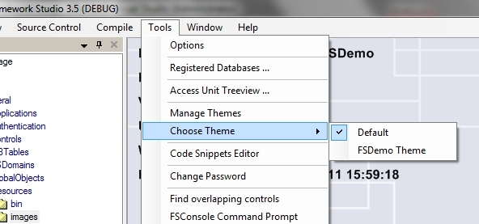
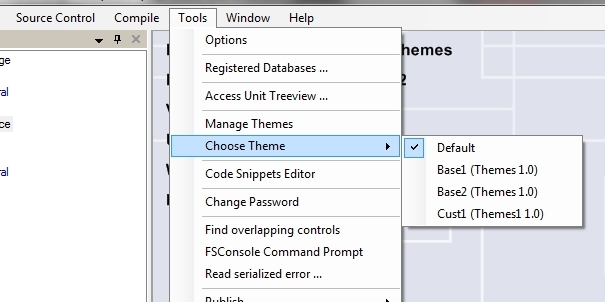
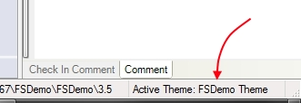

# Zwischen Themes wechseln

Sind im aktuellen Package oder in dessen Basis-Packages Themes definiert (und nicht auf **Deprecated** gesetzt) kann das aktive Theme über das Menü **Tools** > **Choose Theme** ausgewählt werden.

> [!NOTE]
> Wird Framework Studio neu gestartet, wird IMMER das Default-Theme geladen.

Menü zur Auswahl des aktiven Themes:

Wenn das aktive Package über ein oder mehrere Basis-Packages verfügt, in denen auch Themes definiert sind, werden diese mit dem jeweiligen Package Namen angezeigt.

Themes aus Basis-Packages:

Das aktuell aktive Theme wird auch rechts in der Framework Studio Statusleiste angezeigt.

Anzeige des aktiven Themes:

